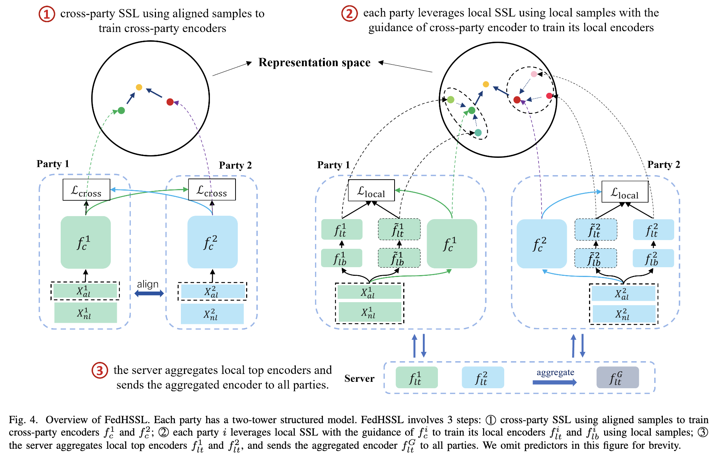

# FedHSSL
This is the official repo for the paper [A Hybrid Self-Supervised Learning Framework for Vertical Federated Learning](https://arxiv.org/abs/2208.08934).

## 1. Methodology



## 2. Settings: model and dataset

 Dataset                | number of clients | model | batch_size:pretrain  | batch_size:cls  | pretrain_epochs | 
|------------------------|:---------------: |:---------------: | :---------------: | :---------------: |:--------------------------:|
| nuswide10classes2party |    2 | mlp2 | 512 | 512 |             10             |
| mn4party               |  4 | resnet | 512 | 128 |             40             | 
| bhi2party              |  2| resnet | 512 | 128 |             40             | 
| ctr_avazu2party        |  2| dnnfm | 512 | 512 |             40             | 

We use the following datasets for experiments. 
- `NUSWIDE` can be downloaded at [here](https://lms.comp.nus.edu.sg/wp-content/uploads/2019/research/nuswide/NUS-WIDE.html) or [here](https://opendatalab.com/OpenDataLab/NUS-WIDE)
- `Avazu` is located in the [data](https://github.com/yankang18/FedCVT/tree/main/data) directory.
- `BHI`
  
You can adopt any dataset to run the code. 

### Aligned and labeled data splitting.

Settings used: 'aligned_label_percent' is [0.2, 0.4], meaning 20% and 40% of all training data are aligned, resepectively.
. 'label_percent' is [200, 400, 600, 800, 1000].
 

### Main args
 id  |         args          |            description            |  
|-----|:---------------------:|:---------------------------------:| 
| 1   |           k           |         number of clients         | 
| 2   | aligned_label_percent |     aligned label percentage      |  
| 3   |     label_percent     |      # of samples used in ft      |  
| 4   |    pretrain_method    |     'simsiam', 'byol', 'moco'     |  
| 5   |   aggregation_mode    |         'pma': enable pma         |  
| 6   |   pretrain_lr_decay   | 1: enable; 0: disable. default: 1 |  
| 8   |    use_local_model    |    1: enable local model in ft    |  

## 3. Classificaiton
Classification and Finetuning learning_rate is set to [0.005 0.01 0.03 0.05].

### Vanilla Classification
```buildoutcfg
python main_cls.py --dataset nuswide10classes2party --model mlp2 --input_size 32 \ 
--batch_size 512 --k 2 --learning_rate 0.03
```


## 4. Pretrain
By default, the pretrained model is saved in the 'premodels' directory, which can be changed by modifying args 'pretrain_model_dir'. This directory
is also used by main_cls.py for loading pretrained models.

#### a. FEDCSSL: only use aligned data for pretraining
```buildoutcfg
python main_pretrain.py --dataset nuswide10classes2party --model mlp2 --input_size 32 --batch_size 512 --k 2 \
--pretrain_method simsiam --aligned_label_percent 0.2
```

#### b. FEDGSSL: FEDCSSL + use unaligned data for local SSL (without aggregation of local top models)
```buildoutcfg
python main_pretrain.py --dataset nuswide10classes2party --model_type mlp2 --input_size 32 --batch_size 512 --k 2 \
--pretrain_method simsiam --local_ssl 1 --aligned_label_percent 0.2
```

#### c. FEDHSSL: FEDGSSL + aggregation of local top models 
```buildoutcfg
python main_pretrain.py --dataset nuswide10classes2party --model mlp2 --input_size 32 --batch_size 512 --k 2 \
--pretrain_method simsiam --local_ssl 1 --aggregation_mode pma --aligned_label_percent 0.2

```
## 5. Finetune
Note that the pretrained_path should match the format defined in prepare_experiments.py (here model name is used as the name string), please refer to a pretrained model.
```buildoutcfg
python main_cls.py --dataset nuswide10classes2party --model mlp2 --input_size 32 \ 
--batch_size 512 --k 2 --pretrained_path mlp2
```

## 6. Citation

Please kindly cite our paper if you find this code useful for your research.

```
@article{he2024hybrid,
  author={He, Yuanqin and Kang, Yan and Zhao, Xinyuan and Luo, Jiahuan and Fan, Lixin and Han, Yuxing and Yang, Qiang},
  journal={IEEE Transactions on Big Data}, 
  title={A Hybrid Self-Supervised Learning Framework for Vertical Federated Learning}, 
  year={2024},
  volume={},
  number={},
  pages={1-13},
  doi={10.1109/TBDATA.2024.3403386}}
```


